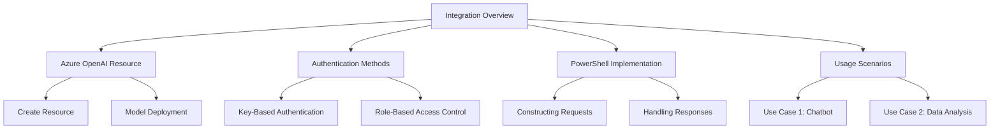
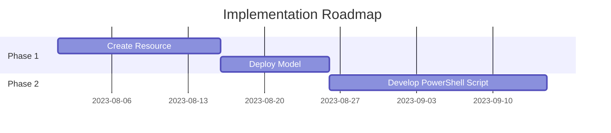

# Executive Summary of Using Azure OpenAI GPT via REST

Video by John Savill's Technical Training

<iframe width="100%" height="415" src="https://www.youtube.com/embed/PXRg1QQ3GFs" frameborder="0" allowfullscreen></iframe>

[Watch on YouTube](https://www.youtube.com/watch?v=PXRg1QQ3GFs)

# Technical Document: Integrating GPT-4 with Azure OpenAI Service via PowerShell

## 1. Executive Summary
- This document outlines the integration of GPT-4 using the Azure OpenAI Service through REST API calls from PowerShell.
- Key outcomes include understanding the setup process, authentication methods, and interaction with the model.
- Recommendations focus on best practices for security and efficient usage.

## 2. Project Visualization


## 3. Introduction
- **Problem Statement**: Many users seek to leverage AI capabilities without extensive programming knowledge.
- **Objectives**: Demonstrate how to interact with GPT-4 using PowerShell and REST API.
- **Key Benefits**: Simplified access to AI models, enabling diverse applications such as chatbots and data analysis.

## 4. Core Functionality
### 4.1 Technology Overview
- **Azure OpenAI Service**: Provides access to advanced AI models like GPT-4.
- **REST API**: Allows communication with the service using standard HTTP requests.

### 4.2 Key Components
1. **Azure OpenAI Resource**: Required for accessing the model.
2. **Model Deployment**: Specific instance of a model (e.g., GPT-4) that is deployed for use.
3. **Endpoints**: URLs used to send requests to the model.

### 4.3 Step-by-Step Process Breakdown
1. Create an Azure OpenAI resource in the Azure portal.
2. Deploy a model (e.g., GPT-4) within the resource.
3. Obtain keys and endpoint information for authentication and requests.

## 5. Implementation
### 5.1 Preparation Steps
1. **Create Azure OpenAI Resource**:
   - Navigate to Azure portal.
   - Select "Azure OpenAI" and create a new resource.
   - Choose region, name, and pricing tier.

2. **Model Deployment**:
   - Access Azure AI Studio to deploy models.
   - Note the deployment name and endpoint URL.

### 5.2 PowerShell Script Overview
- **Environment Variables**: Store sensitive information like endpoint and deployment name.
- **Authentication**: Use either key-based or role-based access control.

### 5.3 Example PowerShell Code Snippet
```powershell
# Set environment variables
$env:OPENAI_ENDPOINT = "https://<resource-name>.openai.azure.com"
$env:DEPLOYMENT_NAME = "<deployment-name>"

# Authenticate and get access token
$token = Get-AzAccessToken -ResourceUrl "https://cognitiveservices.azure.com/"
$headers = @{
    "Content-Type" = "application/json"
    "Authorization" = "Bearer $($token.Token)"
}

# Construct request body
$body = @{
    "messages" = @(
        @{ "role" = "system"; "content" = "You are an AI assistant." },
        @{ "role" = "user"; "content" = "What is the capital of the US?" }
    )
    "max_tokens" = 100
    "temperature" = 0.7
} | ConvertTo-Json

# Send POST request
$response = Invoke-RestMethod -Uri "$($env:OPENAI_ENDPOINT)/v1/chat/completions" -Method Post -Headers $headers -Body $body
$response.choices[0].message.content
```

## 6. Monitoring and Best Practices
### 6.1 Key Metrics to Track
- Token usage per request.
- Response times for API calls.

### 6.2 Security Recommendations
1. Use role-based access control (RBAC) for least privilege.
2. Store keys securely in Azure Key Vault.

### 6.3 Troubleshooting Guide

| Issue | Possible Cause | Resolution |
|-------|----------------|------------|
| Authentication Failure | Invalid token or key | Check token validity and permissions |
| Model Not Responding | Incorrect endpoint | Verify endpoint URL and deployment name |
| High Costs | Excessive token usage | Optimize prompts and limit interactions |

## 7. Recommendations and Roadmap
### 7.1 Top Recommendations
1. Implement RBAC for secure access management.
2. Monitor usage regularly to avoid unexpected costs.
3. Explore additional features like content filtering for safety.

### 7.2 Implementation Timeline


## 8. Additional Resources
- Official documentation: [Azure OpenAI Documentation](https://docs.microsoft.com/en-us/azure/cognitive-services/openai/)
- Community forums: [Azure AI Community](https://techcommunity.microsoft.com/t5/azure-ai/bd-p/Azure-AI)

---

*Report by: [Your Name] | Date: [Today] | Version: [1.0]*

## Glossary
- **API**: Application Programming Interface.
- **RBAC**: Role-Based Access Control.
- **SDK**: Software Development Kit.
- **TLS**: Transport Layer Security.
- **JSON**: JavaScript Object Notation.
- **HTTP**: Hypertext Transfer Protocol.
- **REST**: Representational State Transfer.
