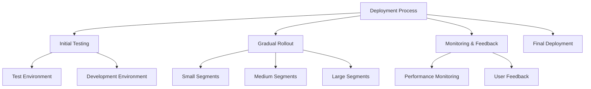
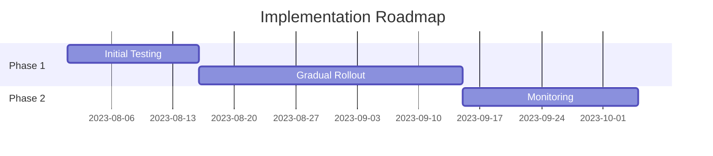

# Executive Summary of How to Deploy Changes - Safe Deployment Practices (SDP)

Video by John Savill's Technical Training

<iframe width="100%" height="415" src="https://www.youtube.com/embed/sDkY-pG6LCc" frameborder="0" allowfullscreen></iframe>

[Watch on YouTube](https://www.youtube.com/watch?v=sDkY-pG6LCc)

# Safe Deployment Practices: A Comprehensive Guide

## 1. Executive Summary
- Overview of safe deployment practices for software updates and changes.
- Emphasis on gradual rollouts to build confidence and minimize risks.

## 2. Deployment Visualization

## 3. Introduction
- **Problem Statement**: Rapid changes can lead to system failures and security vulnerabilities.
- **Objectives**: Establish a framework for safe deployment practices.
- **Key Benefits**: Reduces risk of downtime, enhances system reliability, and improves user confidence.

## 4. Core Principles of Safe Deployment
1. **Incremental Changes**: Avoid changing everything at once; implement small, manageable updates.
2. **Build Confidence**: Start with less critical systems to validate changes before broader deployment.
3. **Testing**: Conduct thorough testing (smoke, functional, stress) at each stage of deployment.
4. **Monitoring**: Establish baseline performance metrics to detect anomalies post-deployment.

## 5. Implementation Steps
### 5.1 Preparation and Configuration
1. **Identify Change**: Determine the nature of the change (software update, configuration change).
2. **Establish Maintenance Windows**: Schedule updates during low-impact periods.
3. **Define Rollout Strategy**: Use deployment rings to segment the rollout process.

### 5.2 Deployment Best Practices
1. **Start Small**: Begin with test environments or non-critical systems.
2. **Gradual Rollout**: Increase the size of the deployment in stages (e.g., from test to development to production).
3. **Automate Processes**: Utilize Infrastructure as Code (IaC) to minimize human error.

### 5.3 Integration with Other Systems
- Ensure compatibility with existing systems and configurations.
- Use APIs and automation tools for seamless integration.

## 6. Monitoring and Best Practices
### 6.1 Key Metrics to Track
1. **Performance Metrics**: CPU usage, memory consumption, response times.
2. **Error Rates**: Monitor logs for any increase in errors post-deployment.
3. **User Feedback**: Collect feedback from users to identify issues early.

### 6.2 Security Recommendations
- Limit access to critical systems.
- Regularly update antivirus definitions and security patches.

### 6.3 Troubleshooting Guide
| Issue | Possible Cause | Resolution |
|-------|----------------|------------|
| System Crash | Incompatible update | Rollback to previous version |
| Performance Drop | Resource overload | Scale resources or optimize configurations |
| Security Breach | Outdated antivirus | Update definitions immediately |

## 7. Recommendations and Roadmap
1. **Adopt Continuous Deployment**: Implement small, frequent updates rather than large releases.
2. **Utilize Automation Tools**: Leverage CI/CD pipelines for efficient deployments.
3. **Conduct Regular Training**: Ensure teams are familiar with safe deployment practices.

## 8. Additional Resources
- Official documentation on Azure Guest Patching Services: [Link]
- Community forums for troubleshooting and best practices.

---

*Report by: [Your Name] | Date: [Today] | Version: [1.0]*

## Glossary
- **IaC**: Infrastructure as Code - managing infrastructure through code.
- **CI/CD**: Continuous Integration/Continuous Deployment - practices for automating software delivery.
- **VM**: Virtual Machine - an emulation of a computer system.
- **OS**: Operating System - software that manages computer hardware and software resources.
- **API**: Application Programming Interface - a set of rules for building software applications.
