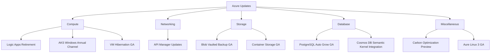
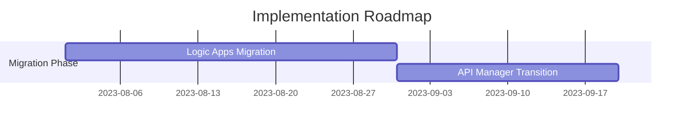

# Executive Summary of Azure Update - 2nd August 2024

Video by John Savill's Technical Training

<iframe width="100%" height="415" src="https://www.youtube.com/embed/wcIn9AzETeI" frameborder="0" allowfullscreen></iframe>

[Watch on YouTube](https://www.youtube.com/watch?v=wcIn9AzETeI)

# Azure Infrastructure Update: August 2, 2023

## 1. Executive Summary
- Overview of recent Azure updates and enhancements.
- Key recommendations for migration and adoption of new features.

## 2. Project Visualization

## 3. Introduction
- **Problem Statement**: Azure users face challenges with legacy services and need to adapt to new features for improved efficiency.
- **Objectives**: Highlight critical updates and provide guidance on migration.
- **Key Benefits**: Enhanced performance, security, and operational efficiency.

## 4. Core Functionality
### 4.1 Compute Updates
1. **Logic Apps Retirement**: 
   - Integrated Service Environment (ISE) will be retired by August 2024.
   - Users must migrate to Logic Apps Standard.
   - VS Code offers an export option for easy migration.

2. **AKS Windows Annual Channel**:
   - Preview available for Windows node pools.
   - Supports container images built on Windows Server 2022/2025.
   - Facilitates easier upgrades without rebuilding images.

3. **VM Hibernation GA**:
   - Saves memory and CPU state to disk.
   - Useful for virtual desktop scenarios to avoid compute costs while retaining state.

### 4.2 Networking Updates
1. **API Manager Developer Portal**:
   - Now supports WordPress plugins for customization.
   - Enhances user experience with themes and localization.

### 4.3 Storage Updates
1. **Blob Vaulted Backup GA**:
   - Backups stored in a separate storage account for enhanced protection.
   - Utilizes object replication for recovery points.

2. **Container Storage GA**:
   - Designed for Kubernetes workloads.
   - Simplifies storage management without needing Azure primitives.

### 4.4 Database Updates
1. **PostgreSQL Auto Grow GA**:
   - Automatically expands storage as data increases.
   - Ensures replicas keep pace to avoid integrity issues.

2. **Cosmos DB Semantic Kernel Integration**:
   - Enables natural language processing with high-dimensional vectors.
   - Facilitates advanced data retrieval based on semantic meaning.

## 5. Implementation
### 5.1 Migration Steps
1. **Logic Apps**: Transition workflows from ISE to Logic Apps Standard before August 2024.
2. **API Manager**: Migrate from STV1 to STV2 for enhanced security features.

### 5.2 Best Practices
- Regularly review Azure updates to leverage new features.
- Utilize automated tools for migration where available.

## 6. Monitoring and Best Practices
### Key Metrics to Track
- Resource utilization and performance metrics.
- Backup success rates and recovery point objectives.

### Security Recommendations
- Implement customer-managed keys for sensitive data.
- Regularly audit configurations and access controls.

| Issue | Possible Cause | Resolution |
|-------|----------------|------------|
| Logic App Failure | Deprecated ISE | Migrate to Logic Apps Standard |
| API Manager Issues | STV1 Retirement | Transition to STV2 |

## 7. Recommendations and Roadmap
1. **Migrate Legacy Services**: Prioritize moving from deprecated services to current offerings.
2. **Adopt New Features**: Leverage auto-scaling and backup enhancements for operational efficiency.
3. **Monitor Carbon Footprint**: Utilize Azure Carbon Optimization tools to align with sustainability goals.

## 8. Additional Resources
- Official documentation: [Azure Updates](https://azure.microsoft.com/en-us/updates/)
- Community forums and tutorials for further learning.

---
*Report by: [Azure Team] | Date: [August 2, 2023] | Version: [1.0]*

## Glossary
- **GA**: General Availability
- **AKS**: Azure Kubernetes Service
- **ISE**: Integrated Service Environment
- **VM**: Virtual Machine
- **API**: Application Programming Interface
